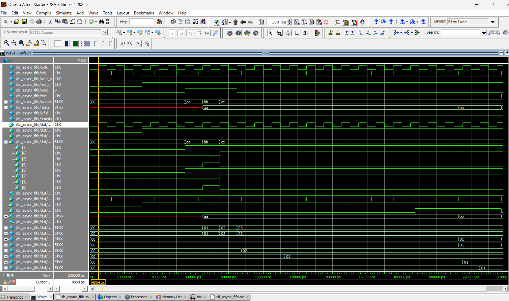

# Asynchronous FIFO (Clock Domain Crossing)

## Project Overview
This project implements a parameterizable **Asynchronous FIFO** designed to safely transfer data between two independent clock domains operating at different frequencies. It addresses the critical challenge of **Clock Domain Crossing (CDC)** by utilizing **Gray Code pointers** and **2-stage synchronizers** to prevent metastability and ensure glitch-free flag generation.

## Key Features
- **Dual-Clock Support:** safely handles completely asynchronous Write (`wclk`) and Read (`rclk`) domains.
- **CDC Safety:** Implements **Binary-to-Gray** conversion for address pointers to ensure only 1-bit changes per clock cycle, eliminating multi-bit synchronization errors.
- **Robust Synchronization:** Uses **2-Stage Flip-Flop Synchronizers** to pass pointers between domains.
- **Pessimistic Flag Generation:** Generates `Full` and `Empty` flags in the source domain to guarantee no overflow or underflow occurs.
- **Parametrized Design:** Configurable Data Width and FIFO Depth (Default: 8-bit Data, 16-slot Depth).

## File Structure
* **`rtl/async_fifo.sv`**: The synthesizable RTL design containing the dual-port memory, pointer logic, and synchronizers.
* **`tb/tb_async_fifo.sv`**: A self-checking SystemVerilog testbench that generates dual clocks to verify data integrity.

## Simulation & Verification
The design was verified using a dual-clock simulation to stress-test the CDC logic.
* **Write Domain:** 100 MHz
* **Read Domain:** 40 MHz

### Waveform Analysis

**1. Functional Verification**
The waveform below confirms data integrity. The transcript highlights the successful burst write of test vectors (`0xAA`, `0xBB`, `0xCC`) and their correct retrieval in the read domain. The `[PASS]` messages confirm the logic is functionally correct.

**2. Timing & CDC Analysis (Zoomed)**
This detailed view demonstrates the asynchronous relationship.
* **Clock Mismatch:** `wclk` (Top) runs at 2.5x the speed of `rclk` (Bottom).
* **Stable Transfer:** Despite the speed difference, data `0xAA` is successfully latched and available on the read bus, proving the synchronizers are working effectively.

