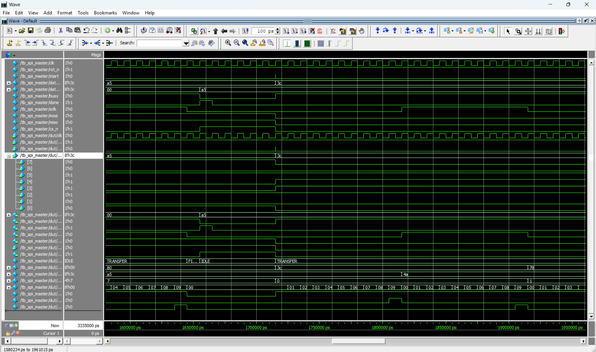

# SPI Master Controller

## Project Overview
This project implements a synthesizable **SPI (Serial Peripheral Interface) Master** controller using SystemVerilog. It is designed to facilitate high-speed, synchronous serial communication with off-chip peripherals such as sensors, Flash memory, and SD cards. The core logic is built around a robust Finite State Machine (FSM) to ensure precise timing and protocol compliance.

## Key Features
- **Protocol Compliance:** Implements standard 4-wire SPI (MOSI, MISO, SCLK, CS_N).
- **Mode 0 Operation:** Configured for Idle-Low Clock (`CPOL=0`) and Rising-Edge Sampling (`CPHA=0`), the most common industry standard.
- **Configurable Speed:** Parametrized Clock Divider (`CLK_DIV`) allows precise tuning of the SCLK frequency derived from the system clock.
- **Robust Architecture:** Uses a 3-State FSM (IDLE $\to$ TRANSFER $\to$ FINISH) to handle Chip Select assertion, data serialization, and sampling safely.

## File Structure
- **`rtl/spi_master.sv`**: The synthesizable RTL core implementing shift registers, clock generation, and control logic.
- **`tb/tb_spi_master.sv`**: A self-checking testbench that performs loopback tests to verify bidirectional data integrity.

## Simulation & Verification
The design was verified using a **Loopback Testbench**, where the Master's MOSI (Output) pin is wired directly to its MISO (Input) pin to simulate a perfect Slave device.

### Waveform Analysis
The simulation below validates a successful transaction of byte `0x3C`.
1.  **Transaction Start:** `CS_N` asserts (Low) and `SCLK` begins toggling.
2.  **Data Serialization:** The `MOSI` line shifts out the data (`00111100`) bit-by-bit.
3.  **Loopback Verification:** Since MOSI is tied to MISO, the controller receives its own data. The `data_out` register correctly updates to `0x3C` at the end of the transaction, confirming that both the Transmit and Receive paths are functional.

