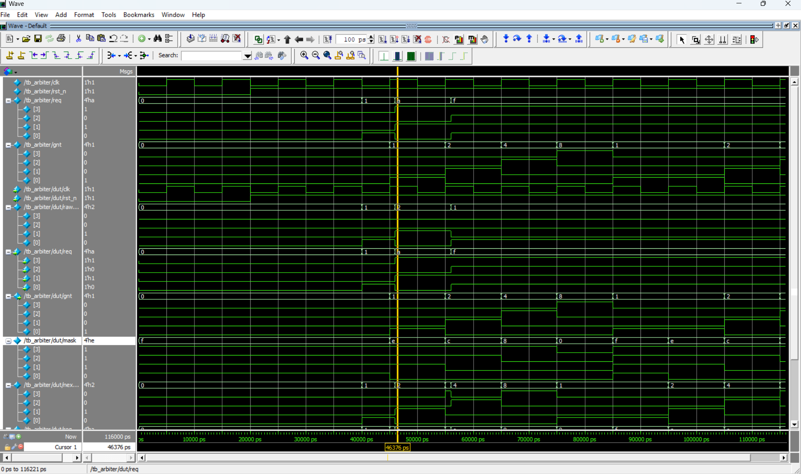

# 4-Port Round-Robin Arbiter

## Project Overview
This project implements a synthesizable, fair **Round-Robin Arbiter** using SystemVerilog. It manages access to a shared resource (such as a generic bus, memory controller, or Network-on-Chip router) among 4 distinct agents. 

Unlike fixed-priority schemes where high-priority devices can monopolize the bus, this design employs a **Rotating Priority** mechanism. This guarantees that no agent is ever starved of service, regardless of request density.

## Key Features
- **Fairness Guarantee:** Implements a "Masked Priority" scheme that rotates the grant token after every successful transaction.
- **Starvation Free:** Even if Agent 0 holds its request line high indefinitely, the arbiter forces it to wait until Agents 1, 2, and 3 have been served.
- **Zero-Latency:** Pure combinational logic determines the next grant immediately within the same clock cycle.
- **Scalable Architecture:** The masking logic is designed to be easily scalable to $N$ ports without complex nested `if-else` chains.

## File Structure
- **`rtl/arbiter.sv`**: The synthesizable RTL core implementing the Masking Logic, Priority Encoders, and State Pointers.
- **`tb/tb_arbiter.sv`**: A self-checking testbench that validates the rotation logic under heavy contention (Saturation Scenario).

## Simulation & Verification
The design was verified using a directed testbench to prove the circular priority logic.

### Waveform Analysis
The screenshot below demonstrates the **Saturation Scenario** where all 4 agents request access simultaneously (`req = 4'b1111`).
1.  **Cycle 1:** Grant given to Agent 0 (`0001`).
2.  **Cycle 2:** Grant rotates to Agent 1 (`0010`).
3.  **Cycle 3:** Grant rotates to Agent 2 (`0100`).
4.  **Cycle 4:** Grant rotates to Agent 3 (`1000`).
5.  **Cycle 5:** Grant wraps around correctly to Agent 0 (`0001`).

This "staircase" pattern in the `gnt` signal proves the arbiter is functioning with perfect fairness.

