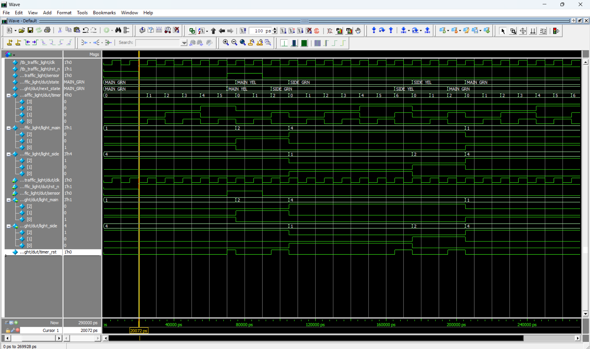

# Smart Traffic Light Controller (Sensor-Based)

## Project Overview
This project implements a **Sensor-Based Traffic Light Controller** using a robust Finite State Machine (FSM) in SystemVerilog. Unlike traditional timer-based systems that cycle blindly, this "Smart" controller optimizes traffic flow by prioritizing the **Main Road**. The Main Road remains Green indefinitely until a specific event—a car detected on the Side Road—triggers a state transition.

This logic prevents the "empty intersection" problem, where a busy highway is stopped for a side street with no cars.

## Real-World Integration :
How does this Verilog code control a physical intersection? Here is the hardware mapping:

1.  **The "Sensor" Input (Inductive Loops):**
    * **In Code:** The `input sensor` signal.
    * **Real World:** This connects to **Inductive Loop Sensors** cut into the asphalt. When a car drives over the loop, the metal chassis changes the magnetic field, generating a logic `High` signal that tells the FPGA/ASIC, "There is a car waiting."

2.  **The FSM Logic (The Brain):**
    * **In Code:** The 4-state Finite State Machine (`MAIN_GRN`, `MAIN_YEL`, etc.).
    * **Real World:** This logic runs on a CPLD, FPGA, or industrial Microcontroller inside the metal traffic cabinet. It ensures safety by enforcing that **Main Green** and **Side Green** can never happen simultaneously.

3.  **The Outputs (Solid State Relays):**
    * **In Code:** The `light_main` and `light_side` 3-bit outputs (`100`=Red, `010`=Yellow, `001`=Green).
    * **Real World:** These low-voltage digital signals drive **Solid State Relays (SSRs)**. The SSRs act as switches for the high-voltage (110V/220V) power lines that light up the actual giant LED bulbs hanging over the street.

## Key Features
-   **Main Road Priority:** The system defaults to `MAIN_GRN` and holds it forever if the side road is empty, maximizing highway throughput.
-   **Sensor Interrupt:** The FSM only transitions when the `sensor` input detects a vehicle, making the system reactive to real-time traffic conditions.
-   **Safety Intervals:** Implements mandatory Yellow-Light states (`MAIN_YEL`, `SIDE_YEL`) to prevent accidents during transitions.
-   **Automatic Reset:** Once the Side Road traffic is cleared (or the fixed time window expires), the system automatically reverts priority to the Main Road.
-   **Parametrized Timing:** State durations are defined using SystemVerilog parameters (`T_YEL`, `T_SIDE`), allowing for easy calibration of light timings.

## Simulation & Verification
The design was verified using a dynamic testbench to validate the sensor-trigger logic.

### Waveform Analysis
The screenshot below demonstrates a complete traffic control cycle:
1.  **Idle State:** The controller waits in `MAIN_GRN` (Main Green) while `sensor` is Low.
2.  **Trigger:** A car triggers the `sensor` (Logic High), forcing the Main Road to cycle Yellow $\to$ Red.
3.  **Cross-Traffic:** The Side Road is granted `SIDE_GRN`.
4.  **Auto-Return:** After the timer counts up to `T_SIDE`, the controller forces the Side Road to Yellow $\to$ Red and returns the Main Road to Green.



## Micro-Architecture

```mermaid
graph LR

    classDef inputs fill:#F4D03F,stroke:#F1C40F,stroke-width:2px,color:#000,font-weight:bold;
    classDef outputs fill:#E67E22,stroke:#D35400,stroke-width:2px,color:#fff,font-weight:bold;
    classDef logic fill:#8E44AD,stroke:#9B59B6,stroke-width:2px,color:#fff,font-weight:bold;
    classDef timer fill:#3498DB,stroke:#2980B9,stroke-width:2px,color:#fff,font-weight:bold;
    classDef container fill:none,stroke:#BDC3C7,stroke-width:2px,stroke-dasharray: 5 5,color:#fff;


    CLK[clk]:::inputs
    RST[rst_n]:::inputs
    SENS[sensor]:::inputs


    subgraph Controller_Unit [Controller]
        direction TB
        FSM[State Machine]:::logic
        TMR[Timer Counter]:::timer
    end

    L_MAIN[light_main]:::outputs
    L_SIDE[light_side]:::outputs

    CLK --> FSM
    CLK --> TMR
    RST --> FSM
    RST --> TMR

    SENS -- Trigger --> FSM
    FSM -- Enable --> TMR
    TMR -- Time Done --> FSM
    

    FSM -- Control --> L_MAIN
    FSM -- Control --> L_SIDE

    class Controller_Unit container
