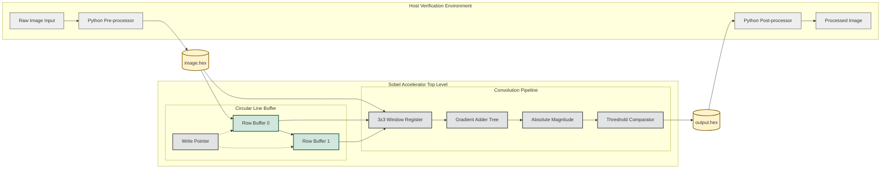

Here is a professional, industry-standard `README.md` suitable for a senior engineer's portfolio. It prioritizes technical density over decoration, removes all emojis, and uses a high-contrast Mermaid diagram for architectural clarity.

### **File: `README.md**`

```markdown
# FPGA-Based Real-Time Sobel Edge Detection Accelerator

## Project Overview
This repository contains a synthesizable Verilog implementation of a Sobel Edge Detection accelerator designed for high-throughput image processing applications. The architecture utilizes a fully pipelined systolic array approach to perform 2D convolution on streaming pixel data, enabling real-time edge extraction without frame buffering.

The design targets FPGA platforms (Xilinx/Intel) and features a resource-efficient circular line buffer to minimize on-chip memory usage. Verification is performed via a bit-accurate Python-hardware co-simulation environment.

## System Architecture
The core architecture operates on a 1-pixel-per-clock basis. Incoming pixel streams are stored in a dual-port Block RAM (BRAM) line buffer to align vertical data columns. A 3x3 sliding window feeds the pipelined Sobel convolution kernel, which calculates gradient magnitude and applies binary thresholding.



## Technical Specifications

| Feature | Specification |
| --- | --- |
| **HDL Standard** | Verilog-2001 (IEEE 1364-2001) |
| **Clock Domain** | Single Synchronous Clock |
| **Throughput** | 1 Pixel / Clock Cycle |
| **Latency** | ~130 Cycles (Line Buffer Fill + Pipeline Depth) |
| **Memory Architecture** | Inferred Dual-Port Block RAM (Circular Buffer) |
| **Arithmetic** | 11-bit Signed Fixed-Point (Internal) |
| **Resolution** | Parameterizable (Default: 128x128) |

## Directory Structure

* **rtl/**: Synthesizable source code.
* `sobel_top.v`: Top-level integration module.
* `sobel_core.v`: 3-stage pipeline for gradient calculation.
* `line_buffer.v`: Memory controller with BRAM inference.


* **tb/**: Simulation testbench files.
* `tb_sobel.v`: Stimulus driver and output monitor.


* **scripts/**: Python utility scripts.
* `img_to_hex.py`: Converts bitmap images to memory initialization files.
* `hex_to_img.py`: Reconstructs output images from simulation dumps.


* **sim/**: Simulation artifacts and waveform dumps.

## Verification Flow

The verification strategy employs a file-based constraint-random approach.

1. **Stimulus Generation**: The `img_to_hex.py` script resizes the input image and serializes pixel data into a hex format readable by Verilog `$readmemh`.
2. **RTL Simulation**: The testbench drives the hex data into the DUT (Device Under Test) on every clock cycle, mimicking a standard video interface (e.g., AXI-Stream or VGA).
3. **Output Reconstruction**: The simulation captures the output stream into a log file, which is reconstructed by `hex_to_img.py` for visual inspection of edge detection quality.

## Usage Instructions

### prerequisites

* Python 3.8+ (NumPy, OpenCV)
* Icarus Verilog or equivalent simulator (ModelSim/Vivado/Questa)

### Execution Steps

1. **Generate Test Vector**
```bash
python scripts/img_to_hex.py --input raw_data/lena.jpg

```


2. **Run Simulation**
```bash
iverilog -o sim/sobel_sim rtl/*.v tb/tb_sobel.v
vvp sim/sobel_sim

```


3. **Verify Output**
```bash
python scripts/hex_to_img.py --input sim/output_image.hex

```


## License

MIT License

```

```
